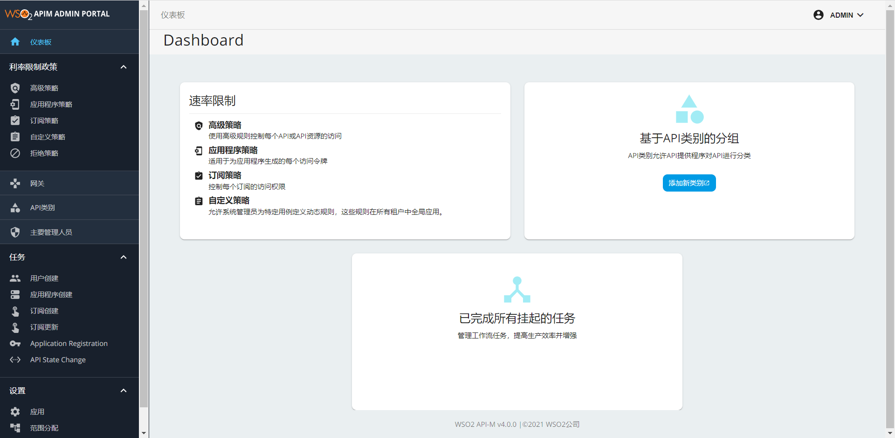

# 概述
WSO2 API Manager Admin 4.0.0 汉化

# 使用说明

## admin
把生成的 dist\wso2 am 4.0.0\admin\zh.json 复制到 wso2am-4.0.0\repository\deployment\server\jaggeryapps\admin\site\public\locales 文件夹下面，刷新页面生效（浏览器语言要设置为中文），不需要重启

## 效果图
访问地址：https://xxx.xxx.xxx.xxx:9443/admin  

