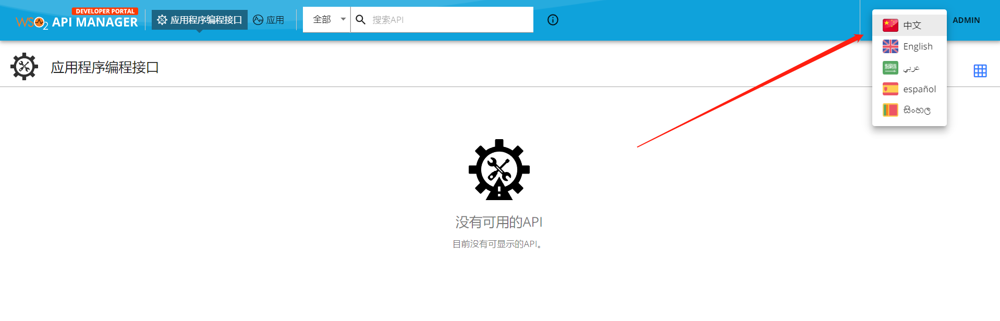

# 概述
WSO2 API Manager Devportal 4.0.0 汉化

# 使用说明

## Devportal
把生成的 dist\wso2 am 4.0.0\devportal\zh.json 复制到 wso2am-4.0.0\repository\deployment\server\jaggeryapps\devportal\site\public\locales 文件夹下面，刷新页面生效（浏览器语言要设置为中文），不需要重启

## 开启语言切换
编辑：wso2am-4.0.0\repository\deployment\server\jaggeryapps\devportal\site\public\theme\userTheme.js 文件，修改如下
```javascript
const Configurations = {
    /*
     This file can be used to override the configurations in devportal/source/src/defaultTheme.js
     ex. Uncomment the below section to enable the landingPage
     */
     /*
     custom: {
         landingPage: {
             active: true,
         },
     },
     */
	 custom: {
		 languageSwitch: {
				active: true,
				languages: [
					{
						key: 'zh',
						image: '/site/public/images/flags/zh.png',//中国图标需要自己下载，大小为 70 x 47 像素
						imageWidth: 24, // in pixles
						text: '中文',
						direction: 'ltr',
					},
					{
						key: 'en',
						image: '/site/public/images/flags/en.png',
						imageWidth: 24, // in pixles
						text: 'English',
						direction: 'ltr',
					},
					{
						key: 'ar',
						image: '/site/public/images/flags/ar.png',
						imageWidth: 24, // in pixles
						text: 'عربي',
						direction: 'ltr',
					},
					{
						key: 'es',
						image: '/site/public/images/flags/sp.png',
						imageWidth: 24, // in pixles
						text: 'español',
						direction: 'ltr',
					},
					{
						key: 'si',
						image: '/site/public/images/flags/si.png',
						imageWidth: 24, // in pixles
						text: 'සිංහල',
						direction: 'ltr',
					}
				],
				showFlag: true,
				showText: true,
				minWidth: 60, // Width of the language switcher in pixles
			},
	 }
};
```
## 开启语言切换的效果
访问地址：https://xxx.xxx.xxx.xxx:9443/devportal <br>

