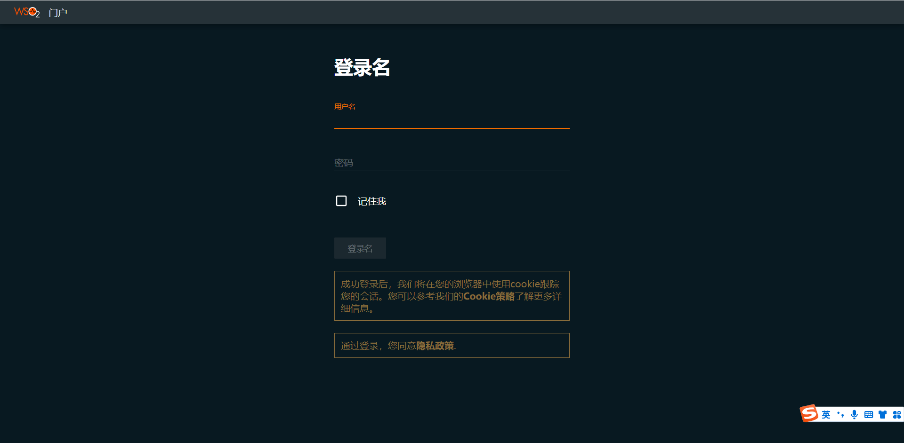

# 概述
WSO2 EI Analytics 6.6.0 汉化

# 使用说明
运行 WSO2 EI Analytics 查看效果图 
运行 wso2ei-6.6.0\wso2\analytics\bin\dashboard.bat或者dashboard.sh

## business_rules
把生成的 dist\wso2 ei 6.6.0\analytics\business_rules_zh.json 复制到 wso2ei-6.6.0\wso2\analytics\wso2\dashboard\deployment\web-ui-apps\business-rules\public\locales 文件夹下面，并重命名为 zh.json，刷新页面生效（浏览器语言要设置为中文），不需要重启
## 效果图
访问地址：https://xxx.xxx.xxx.xxx:9643/business-rules  

## monitoring
把生成的 dist\wso2 ei 6.6.0\analytics\monitoring_zh.json 复制到 wso2ei-6.6.0\wso2\analytics\wso2\dashboard\deployment\web-ui-apps\monitoring\public\locales 文件夹下面，并重命名为 zh.json，刷新页面生效（浏览器语言要设置为中文），不需要重启
## 效果图
访问地址：https://xxx.xxx.xxx.xxx:9643/monitoring  

## portal
把生成的 dist\wso2 ei 6.6.0\analytics\portal_zh.json 复制到 wso2ei-6.6.0\wso2\analytics\wso2\dashboard\deployment\web-ui-apps\portal\public\locales 文件夹下面，并重命名为 zh.json，刷新页面生效（浏览器语言要设置为中文），不需要重启
## 效果图
访问地址：https://xxx.xxx.xxx.xxx:9643/portal  

## portal 窗口小部件
窗口小部件文件夹位置：wso2ei-6.6.0\wso2\analytics\wso2\dashboard\deployment\web-ui-apps\portal\extensions\widgets
各个文件夹下面的 widgetConf.json 文件即为窗口小部件的配置文件，需要汉化请单独修改！窗口小部件建议只汉化 name 和 title 部分，value部分不要去动。