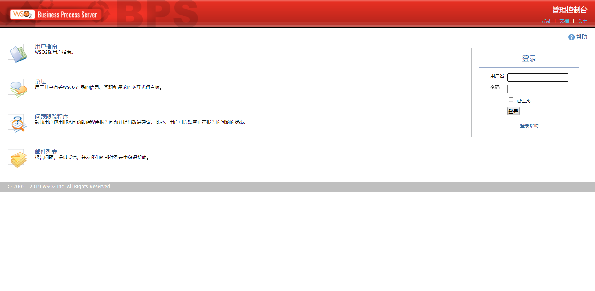
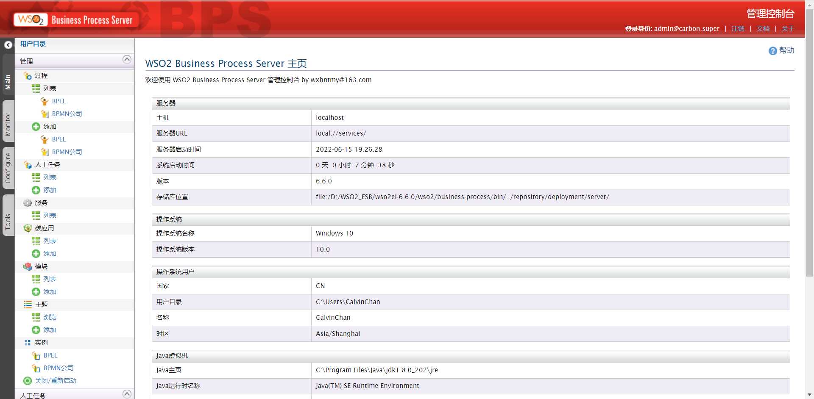
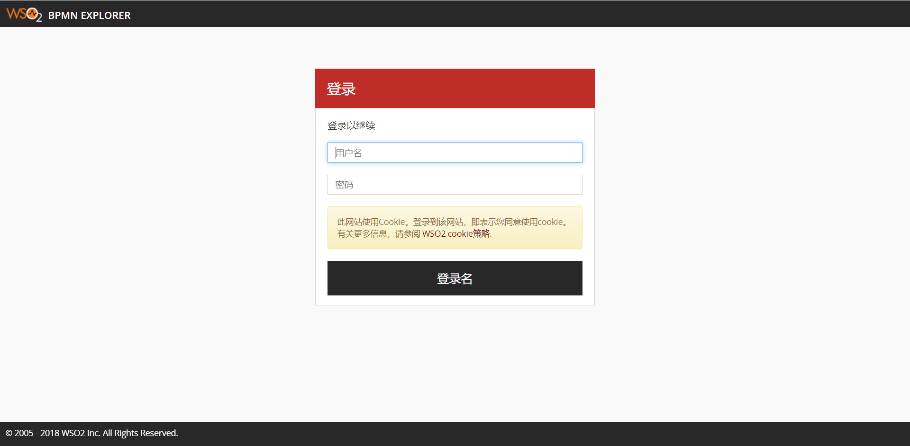
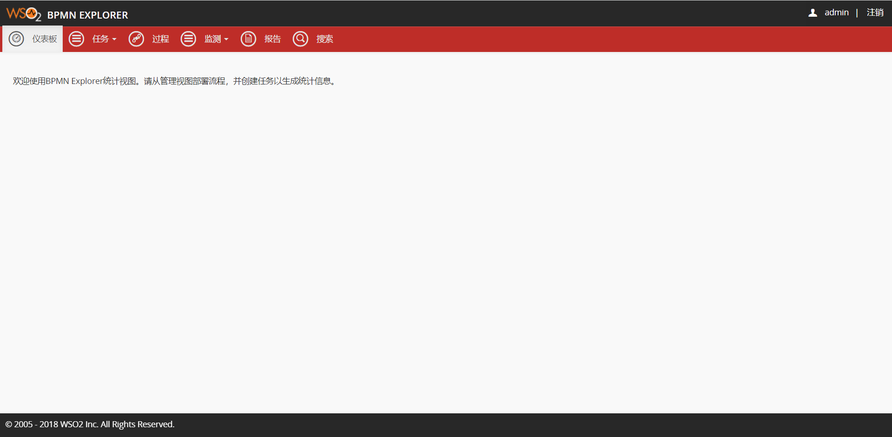
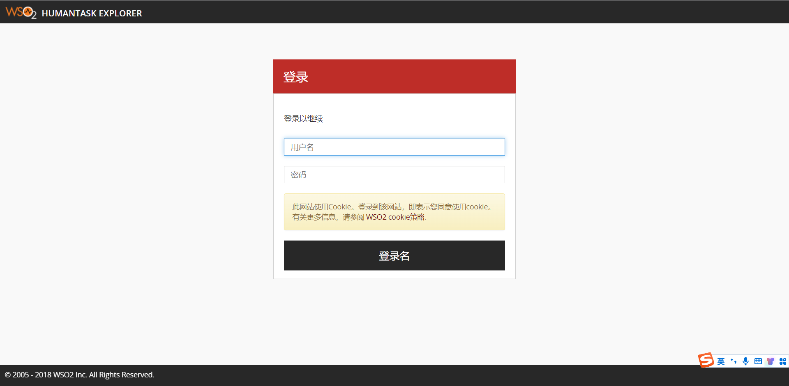
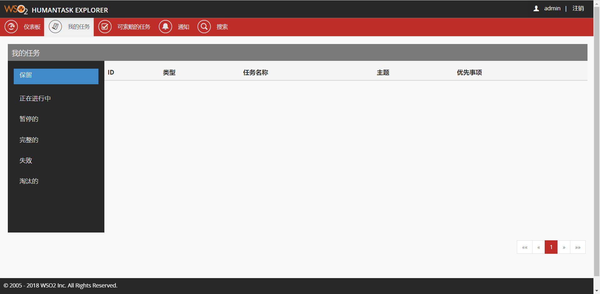

# 概述
WSO2 EI Business-process 6.6.0 汉化

# 使用说明
运行 WSO2 EI Analytics 查看效果图 
运行 wso2ei-6.6.0\wso2\business-process\bin\wso2server.bat或者wso2server.sh

## WSO2 Business Process Server
访问地址：https://xxx.xxx.xxx.xxx:9445/carbon  

## bpmn_explorer
把生成的 dist\wso2 ei 6.6.0\business-process\bpmn_explorer_zh.json 复制到 wso2ei-6.6.0\wso2\business-process\repository\deployment\server\jaggeryapps\bpmn-explorer\config\locales 文件夹下面，并重命名为 locale_zh.json，刷新页面生效（浏览器语言要设置为中文），不需要重启
## 效果图
必须要先登录 WSO2 Business Process Server 才能访问 bpmn_explorer 
访问地址：https://xxx.xxx.xxx.xxx:9445/bpmn-explorer  

## humantask_explorer
把生成的 dist\wso2 ei 6.6.0\business-process\humantask_explorer_zh.json 复制到 wso2ei-6.6.0\wso2\business-process\repository\deployment\server\jaggeryapps\humantask-explorer\config\locales 文件夹下面，并重命名为 locale_zh.json，刷新页面生效（浏览器语言要设置为中文），不需要重启
## 效果图
访问地址：https://xxx.xxx.xxx.xxx:9445/humantask-explorer  

